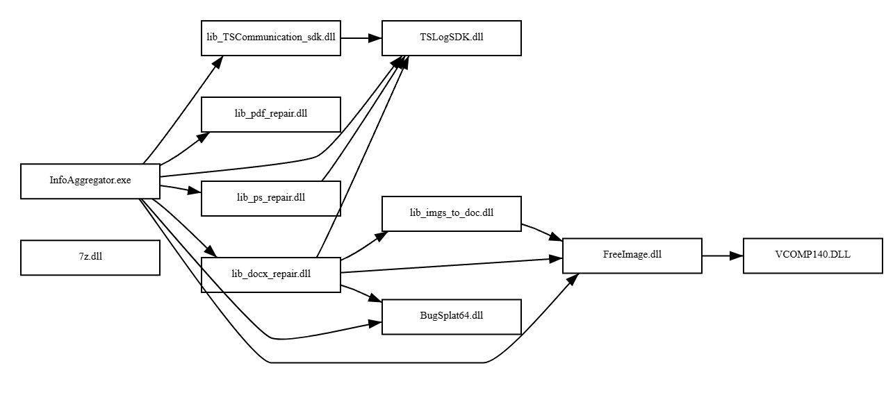

``` 
_____              _____
|  __ \            |  __ \
| |__) |____  _____| |__) |
|  ___/ _ \ \/ / _ \  _  /
| |  |  __/>  <  __/ | \ \
|_|   \___/_/\_\___|_|  \_\


*Name pending change
```

## PexeR

PexeR is a Portable Executable analysis tool that incorporates YARA and string regex and also other things as I think of them. It's pretty fast at pulling out static analysis goodies. 

I'll probably do more with it at some point.

Thanks to goblin for literally doing all the work on the actual parsing for me. 

AI Statement:  
    I totally used AI to generate all those regex rules. That's why they suck. I'd disable the b64 one especially.
    I also used the gemini auto suggestion thing from time to time. More for inspo though. 
    Note: a lot of graph.rs was AI inspired. Specifically the SVG production. 

## Issues

PexeR wants that config.toml in AppData\Local\PexeR. It will not run without it. At some point I might change this. See the config.toml file for an example config. 

## Modes

By default, PexeR will pull out:    
- Metadata:
    - Filename
    - Hash
    - Entropy
    - Authenticode verification
- Sections
    - Name
    - Virtual Address
    - Virtual Size
- Imports
    - DLL
    - Function
- Exports
    - Name
    - Offset
- Strings
    - Uses regex patterns to find "notable" strings
- YARA results 
    - Optionally, provide a path to a directory containing .yar or .yara rules and PexeR will load and test them on the binary

There is also a "deep scan" mode that additionally adds:
- anomaly detection
    - Section name
    - Section size
- overlay detection
    - Injected data at end of binary (between last section and eof)
- packer (wip)

Third party integrations are also suported. Currently, this is only VirusTotal.
- vt
    - Pulls description, analysis, votes, tags
- A Censys/Shodan integration may also happen.
    - This would submit IP addresses found in strings

Graph mode is separate from the other modes. This requires PexeR to be pointed at a directory containing multiple PE files. Graph mode works with `--lenient`. Graph mode will map the imports of the PE files. At some point, this might evolve to be more comprehensive and include export mappings too. Graphs are saved as SVG files. In the future, I'll probably make this optionally output the DOT notation too.    
Example Graph:


The WIP stuff might end up being default too. 

## Usage

Thank you clap help menu 

```
 _____              _____
|  __ \            |  __ \
| |__) |____  _____| |__) |
|  ___/ _ \ \/ / _ \  _  /
| |  |  __/>  <  __/ | \ \
|_|   \___/_/\_\___|_|  \_\

*Name pending change


The Portable Executable eXaminiation Engine (Rust)*, is a CLI tool for analyizing PE files. It pulls basic data and incorporates custom regex and YARA rules.
Future integrations will include VirusTotal, packer detection, an other integrations.


Usage: PexeR.exe [OPTIONS] <FILE>

Arguments:
  <FILE>  Path to PE. Required.

Options:
  -l, --lenient  Lenient parsing mode - disables RVA resolution and uses permissive parsing. This may allow malformed PE files to be parsed. However, it can lead to data and display errors.
  -d, --deep     Deep scanning mode. This will enable packer detection, overlay analysis, and other more intensive scanning techniques.
  -v, --vt       VirusTotal integration. Requires API key in config.toml. This will fetch and display VirusTotal data for the file hash.
  -g, --graph    Graph relationships between PE files in a directory. Saves graph to graph.svg in the working directory. Very much a WIP.
  -h, --help     Print help (see more with '--help')
  -V, --version  Print version
 ```
